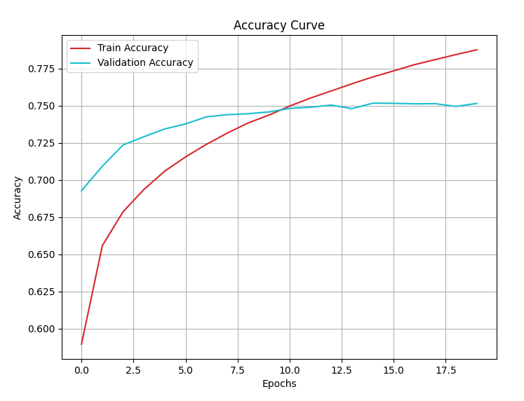
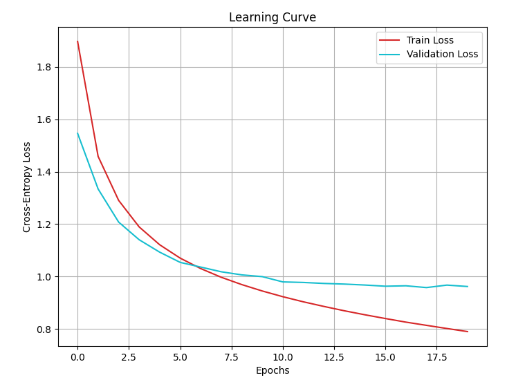
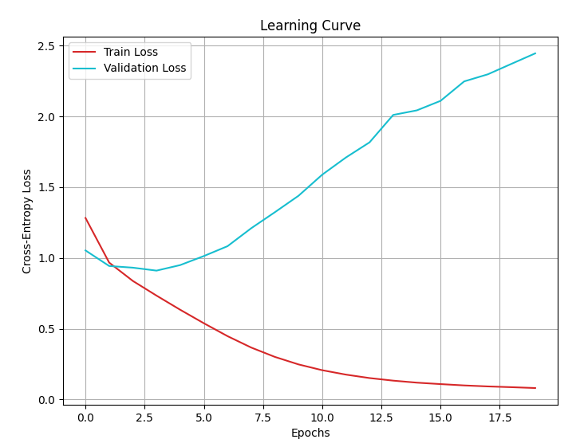
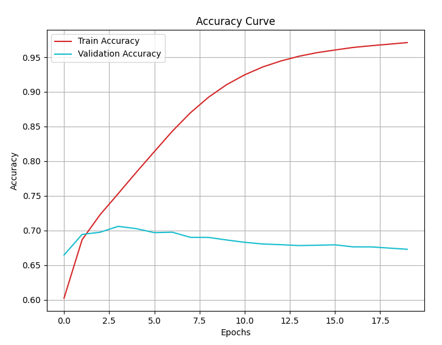
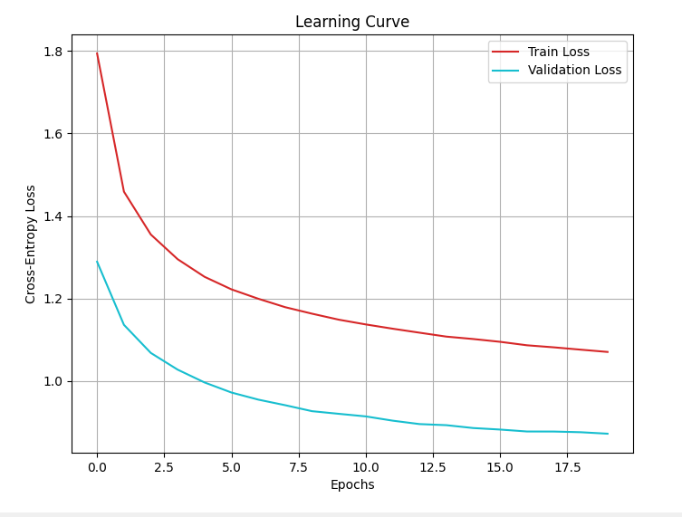
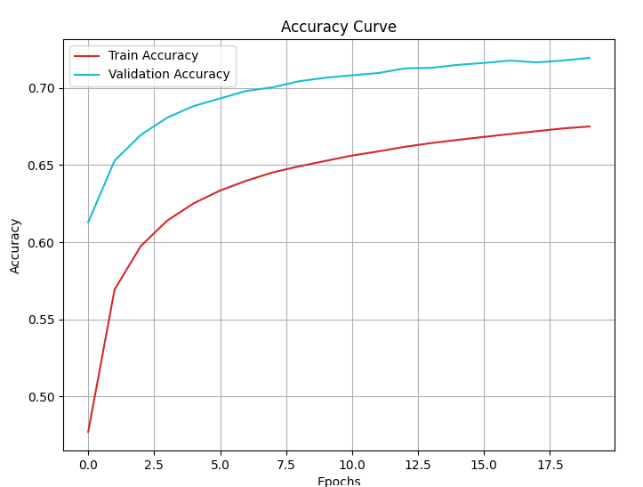
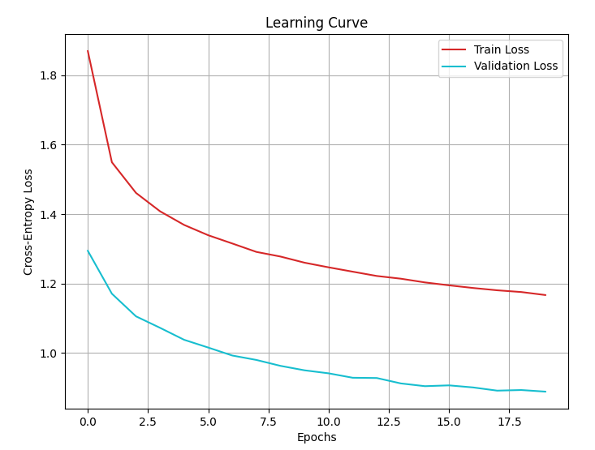
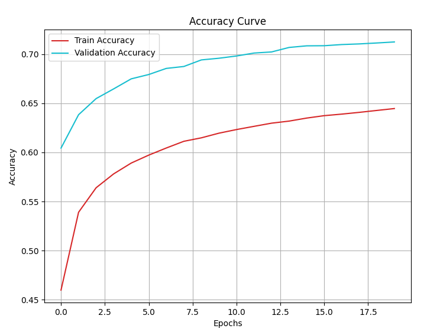

##  Dataset
Dataset 存放於 Hugging Face：[檔案位置](https://huggingface.co/datasets/pollychen/ML2021-HW2-Dataset)

data.zip  
timit_11/  
│── train_11.npy    
│── train_label_11.npy    
└── test_11.npy  

##  Baseline  
Strong Baseline : 0.76023  
Simple Baseline : 0.68334  

##  Kaggle Testing 
| #  | Experiment                                                          | Private Score | Public Score |
|----|-----------------------------------------------------------------|--------------|-------------|
| 1  | **Original**                                                   | 0.68858      | 0.68924     |
| 2  | **1. ReLU**                                                    | 0.69894      | 0.69937     |
| 3  | **1. ReLU + BatchNorm**                                        | 0.70233      | 0.70364     |
| 4  | **1. ReLU + BatchNorm + Dropout(0.2)**                         | 0.72411      | 0.72579     |
| 5  | **1. ReLU + BatchNorm + Dropout(0.2)**    **2. FC Layer 4 → 6**                        | 0. 73321     | 0. 73479    |
| 6  | **1. Pre-processing (concat前後5個frame)**                         | 0.67795      | 0.67916     |
| 7  | **1. ReLU**   **2. FC Layer 4 → 6**   **3. Pre-processing (concat前後5個frame)**  | 0.69148 | 0.69194 |
| 8  | **1. ReLU + Dropout(0.5)**   **2. FC Layer 4 → 6**   **3. Pre-processing (concat前後5個frame)**  | 0.70376 | 0.70440 |
| 9  | **1. ReLU + BatchNorm + Dropout(0.5)**   **2. FC Layer 4 → 6**   **3. Pre-processing (concat前後5個frame)** | 0.69788 | 0.69802 |

## Loss & Accuracy for Each Experiment

### original

    

        <strong>Loss</strong> 
        
    

    

        <strong>Accuracy</strong> 
        
    

### #5

    

        <strong>Loss</strong> 
        
    

    

        <strong>Accuracy</strong> 
        
    

### #6

    

        <strong>Loss</strong> 
        
    

    

        <strong>Accuracy</strong> 
        
    

### #7

    

        <strong>Loss</strong> 
        
    

    

        <strong>Accuracy</strong> 
        
    

### #8

    

        <strong>Loss</strong> 
        
    

    

        <strong>Accuracy</strong> 
        
    

### #9

    

        <strong>Loss</strong> 
        
    

    

        <strong>Accuracy</strong> 
        
    

