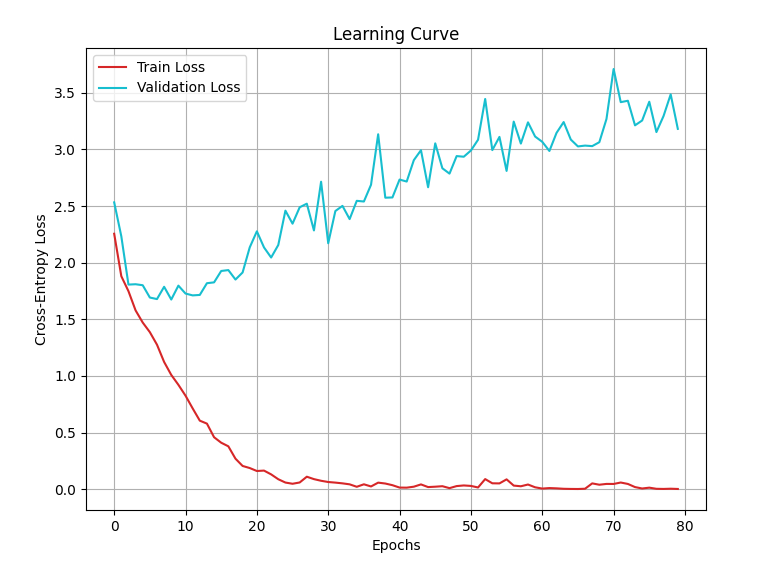
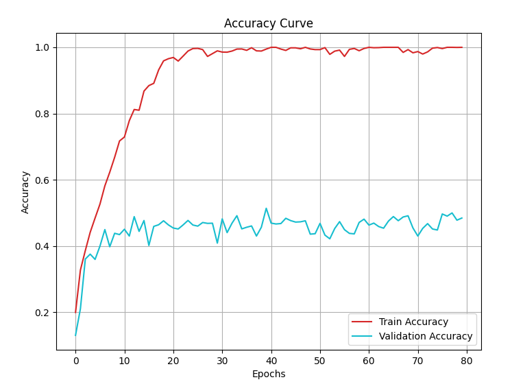

##  Dataset
Dataset 存放於 Hugging Face：[檔案位置](https://huggingface.co/datasets/pollychen/ML2021-HW3-Dataset/tree/main)

```
food-11.zip  
food-11/
│── traitraining/  
│   ├── labeled/  
│   │   ├── 00/  
│   │   ├── 01/  
│   │   ├── ...  
│   │   └── 10/  
│   ├── unlabeled/  
│   │   └── 00/  
│── validation/   
│   ├── 00/  
│   ├── 01/  
│   ├── ...  
│   └── 10/  
└── testing/  
    └── 00/  
```

##  Baseline  
Strong Baseline : 0.82138  
Medium Baseline : 0.52807  
Simple Baseline : 0.44862  

##  Kaggle Testing 
| #  | Experiment                                                          | Private Score | Public Score |
|----|-----------------------------------------------------------------|--------------|-------------|
| 1  | **Original**                                                   | 0.47878      | 0.47789     |
| 2  | **1. Data Augmentation**                                                    | 0.56903      | 0.56391     |
| 3  | **1. Data Augmentation** <br> **2. Conv Layer 3 → 5**                  | 0.58158      | 0.61827     |
| 4  | **1. Data Augmentation** <br> **2. Conv Layer 3 → 5**   <br> **3. FC Layer Dropout(0.6、0.4)**                 | 0.60011      | 0.57646     |

## Loss & Accuracy for Each Experiment

### original
<table>
  <tr>
    <td></td>
    <td></td>
  </tr>
</table>

### #2
<table>
  <tr>
    <td></td>
    <td></td>
  </tr>
</table>

### #3
<table>
  <tr>
    <td></td>
    <td></td>
  </tr>
</table>

### #4
<table>
  <tr>
    <td></td>
    <td></td>
  </tr>
</table>

